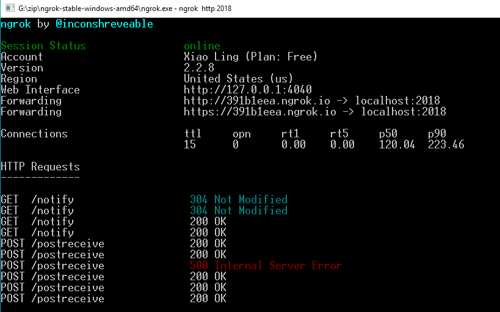
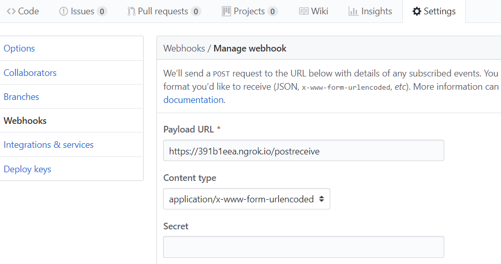
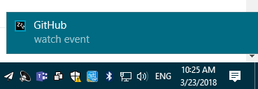

# Webhook Notification
Use Node.js and Ngrok to create a system notification service.

# Installation
- [Ngrok](https://ngrok.com/download)
- Express

    ```
    npm install express
    ```
- node-notifier

    ```
    npm install node-notifier
    ```

# How to Use
1. Run the app.

    ```
    node app.js
    ```

2. Expose the local web server to Internet.

    ```
    ngrok http 2018
    ```

    
    

3. Create a new GitHub repo and configure the Webhooks.

    

4. Star the repo to receive a notification. 

    
